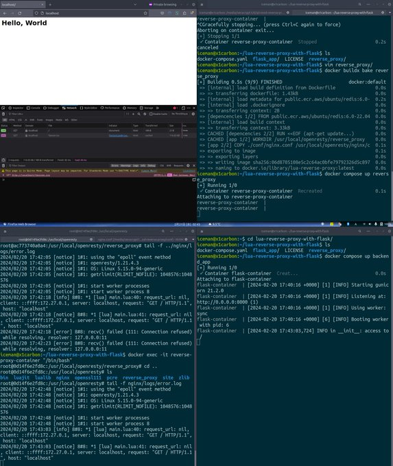

# OpenResty(lua) reverse proxy with flask backend app


## INDEX

- [ABOUT](#about)
- [LICENSE](#license)
- [ENVIRONMENT](#environment)
- [PREPARING](#preparing)
- [HOW TO USE](#how-to-use)
- [ABOUT](#about)

---

## ABOUT

この 2 つを合わせて通信できるようにした感じ。

- [lua-reverse-proxy](https://github.com/RyosukeDTomita/lua-reverse-proxy)
- [flask_app_with_gunicorn](https://github.com/RyosukeDTomita/flask_app_with_gunicorn)

### 動作の仕組み

1. docker-compose.yml でリバースプロキシと backend アプリを定義しているので同じ docker network に所属している。 --> これで docker-compose.yml で定義したサービス名を名前解決してコンテナ間通信ができる。
2. リクエストを受け取った際に nginx.conf に記載のある lua スクリプトが実行される。
3. lua スクリプトにより動的にリクエストを転送するバックエンドが決まる。
4. リクエストがバックエンドに転送される。

### flask cli
現状動作確認のみしかやってないが気が向いたら定期処理とか実行させたい。

```shell
docker compose run -it backend_app "/bin/bash"
root@d8ed0df88ad6:/usr/local/app# ls
Dockerfile   app	 requirements.txt  tests
__pycache__  config.ini  run.py
root@d8ed0df88ad6:/usr/local/app# flask test hello
Hello, World.
```

---

## LICENSE

[UN LICENSE](./LICENSE)

---

## ENVIRONMENT

- reverse proxy
  - openresty
  - lua-nginx-module
- backend
  - flask
  - gunicorn(サービス起動)

---

## PREPARING

just download this repository.

---

## HOW TO USE

コンソールのログみるのが一番わかりやすいのでターミナル 2 つあるといいかも。

```shell
docker buildx bake
docker compose up backend_app
```

```shell
docker compose up reverse_proxy
```



---

## REFERENCES

### My repositories

- [lua-reverse-proxy](https://github.com/RyosukeDTomita/lua-reverse-proxy)
- [flask_app_with_gunicorn](https://github.com/RyosukeDTomita/flask_app_with_gunicorn)

### Others

- [ngx モジュールの使い方](https://qiita.com/kz_takatsu/items/e94805a8e3cc285f9b33#ngxctx)
- [openresty ドキュメント](https://github.com/openresty/lua-nginx-module#directives)
- [逆引き lua-nginx-module](https://gist.github.com/ykst/52205d4d4968298137ea0050c4569170#nginx)
- [nginx.conf の書き方](https://qiita.com/shun198/items/c92977c6cd31eb2187fc)
